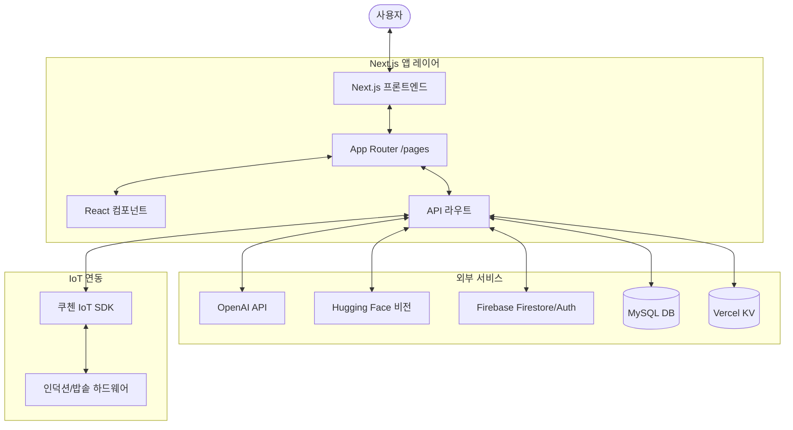

# GrainFlow 웹 아키텍처 (GrainFlow Web Architecture)

이 문서는 사용자 맞춤형 잡곡 추천 AI 챗봇인 GrainFlow 웹 애플리케이션의 아키텍처를 설명합니다.

## 1. 시스템 개요 (System Overview)

GrainFlow는 거대 언어 모델(LLM)을 활용하여 사용자의 건강 상태, 선호도 및 시각/음성 입력을 기반으로 개인화된 잡곡 혼합 비율 추천을 제공합니다.

### 핵심 목표
- **개인화 (Personalization)**: 사용자의 건강 데이터(당뇨, 소화력, 알레르기 등) 수집.
- **멀티모달 입력 (Multi-modal Input)**: 텍스트, 음성(STT), 이미지(카메라) 분석 지원.
- **IoT 연동 (IoT Integration)**: 쿠첸(Cuchen) IoT 밥솥과 연동하여 자동 취사 제어.

---

## 2. 기술 스택 (Technology Stack)

| 레이어 | 기술 | 목적 |
| :--- | :--- | :--- |
| **프론트엔드 프레임워크** | Next.js 14 (App Router) | React 프레임워크, SSR 및 앱 라우팅 지원. |
| **스타일링** | Tailwind CSS | 유틸리티 퍼스트 CSS를 통한 반응형 디자인. |
| **AI SDK** | OpenAI API, Vercel AI SDK | LLM 오케스트레이션 및 스트리밍. |
| **컴퓨터 비전** | Hugging Face Inference | 이미지 분류 (잡곡 종류 인식). |
| **데이터베이스** | Firebase (Firestore/Admin) | 메타데이터, 프롬프트 및 서버 사이드 상태 관리. |
| **저장소/캐시** | Vercel KV | 세션 및 휘발성 데이터용 키-값 저장소. |
| **관계형 DB** | MySQL (`mysql2` 활용) | 구조화된 데이터 저장 (레시피, 사용자 등). |

---

## 3. 디렉토리 구조 (Directory Structure)

```text
web/
├── app/                  # Next.js App Router (페이지 및 라우트)
│   ├── api/              # 백엔드 API 엔드포인트 (Next.js Edge/Node)
│   ├── auth/             # 인증 관련 페이지
│   ├── camera/           # 카메라/이미지 분석 인터페이스
│   ├── chat/             # 핵심 챗봇 인터페이스
│   ├── cooking/          # IoT 취사 제어 인터페이스
│   └── survey/           # 사용자 건강 프로필 설문
├── components/           # 재사용 가능한 UI 컴포넌트
│   ├── ui/               # 기본 UI 프리미티브 (버튼, 입력창 등)
│   ├── ImageAnalyzer.tsx # 비전 로직
│   ├── VoiceRecorder.tsx # STT 로직
│   └── ChatWindow.tsx    # 채팅 오케스트레이션
├── lib/                  # 공통 유틸리티 및 비즈니스 로직
│   ├── apiClient.ts      # 내부 API 래퍼
│   ├── cuchenApi.ts      # IoT 하드웨어 연동 로직
│   └── grainReferences.ts# 잡곡 도메인 관련 데이터
└── types/                # TypeScript 타입 정의
```

---

## 4. 주요 데이터 흐름 (Key Data Flows)

### A. 추천 흐름 (Recommendation Flow)
1. **입력 (Input)**: 사용자가 채팅(텍스트/음성) 또는 설문을 통해 데이터를 제공합니다.
2. **처리 (Processing)**: `lib/openai.ts`에서 `lib/grainReferences.ts`를 활용하여 프롬프트를 구성합니다.
3. **로직 (Logic)**: LLM이 구조화된 JSON(건강 상태, 선호도)을 추출합니다.
4. **출력 (Output)**: `RecommendationCard.tsx`에서 최적의 잡곡 혼합 비율을 시각화합니다.

### B. 이미지 인식 흐름 (Image Recognition Flow)
1. **입력 (Input)**: 사용자가 `app/camera`를 통해 사진을 촬영합니다.
2. **분석 (Analysis)**: `app/api/analyze`로 전송되어 Hugging Face Inference를 호출합니다.
3. **결과 (Result)**: 인식된 잡곡 종류가 UI로 반환되어 추천 컨텍스트에 활용됩니다.

### C. IoT 연동 (IoT Integration)
1. **트리거 (Trigger)**: 사용자가 추천된 잡곡 비율을 수락합니다.
2. **명령 (Command)**: 클라이언트에서 `lib/cuchenApi.ts`를 호출합니다.
3. **실행 (Execution)**: 서버에서 쿠첸 IoT 백엔드로 명령을 전송하여 잡곡 비율을 설정합니다.

---

## 5. 아키텍처 다이어그램 (High-Level Architecture)



---

## 6. 핵심 컴포넌트 (Key Components)

- **`ChatWindow`**: 대화 상태 관리 및 Vercel AI SDK 통합.
- **`VoiceRecorder`**: 음성을 캡처하여 `app/api/stt`로 전송, 텍스트로 변환.
- **`ImageAnalyzer`**: 잡곡 식별을 위한 파일 업로드 및 카메라 스트림 처리.
- **`RecommendationCard`**: 복잡한 잡곡 비율과 영양 정보를 표시하는 특화 UI.
